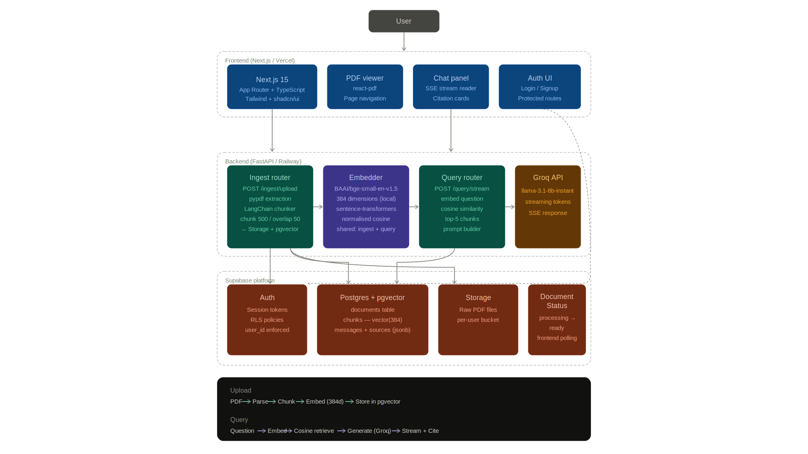

# trace

AI-powered PDF question answering with retrieval-augmented generation (RAG), streaming responses, and page-level citations.

**Live Application:** https://use-trace.vercel.app

## Overview

trace allows users to upload PDFs, ask questions in natural language, and receive grounded answers backed by relevant source pages from the document.

The system processes uploaded PDFs into vector embeddings, stores them in pgvector, retrieves the most relevant chunks for each query, and generates answers using a large language model. Every response includes citations that can be clicked to navigate directly to the referenced PDF pages.

## Features

* Email/password authentication with Supabase Auth
* PDF upload and processing
* In-browser PDF viewer
* Retrieval-Augmented Generation (RAG)
* Streaming responses via Server-Sent Events (SSE)
* Page-level citations
* Click-to-navigate source references
* Vector search using pgvector
* Per-user document isolation

## Live Deployment

Frontend (Vercel)

https://use-trace.vercel.app

Backend (Railway)

https://rag-app-production-6307.up.railway.app

## How It Works

### Upload Pipeline

PDF
→ Text extraction (pypdf)
→ Page-level chunking
→ Embedding generation (BGE-small)
→ Storage in pgvector

Detailed flow:

PDF bytes
→ pypdf
→ pages.json stored in Supabase Storage
→ RecursiveCharacterTextSplitter (500 chunk size, 50 overlap)
→ BAAI/bge-small-en-v1.5 embeddings
→ pgvector storage
→ document status updated to ready

### Query Pipeline

Question
→ Embed question
→ Retrieve most relevant chunks
→ Build prompt with retrieved context
→ Generate answer with Llama 3.1 8B
→ Stream response
→ Return citations

## Architecture



## Demo

Demo media will be added here.


The demo showcases:

* User login
* PDF upload
* Processing completion
* Workspace interaction
* Streaming answer generation
* Citation click and page navigation

## Tech Stack

### Frontend

* Next.js 15
* TypeScript
* Tailwind CSS
* react-pdf

### Backend

* FastAPI
* Python
* Server-Sent Events (SSE)

### AI & Retrieval

* Groq
* llama-3.1-8b-instant
* BAAI/bge-small-en-v1.5
* LangChain RecursiveCharacterTextSplitter

### Data Layer

* Supabase Auth
* Supabase Storage
* PostgreSQL
* pgvector

### Deployment

* Vercel
* Railway

## Key Engineering Decisions

### Why pgvector?

Using pgvector inside PostgreSQL keeps document metadata and vector search in a single database while providing efficient cosine similarity retrieval.

### Why BGE-small?

BGE-small provides strong semantic retrieval quality while remaining lightweight enough for synchronous document ingestion.

### Why Streaming Responses?

Streaming significantly improves perceived responsiveness by allowing users to see answers as they are generated.

### Why Page-Level Citations?

Page references make answers verifiable and improve trustworthiness compared to uncited LLM responses.

## Local Development

### Prerequisites

* Node.js
* Python 3.11+
* Supabase project
* Groq API key

### Frontend

```bash
cd frontend
npm install
npm run dev --webpack
```

### Backend

```bash
cd backend
pip install -r requirements.txt
uvicorn main:app --reload
```

## Environment Variables

Frontend

```env
NEXT_PUBLIC_SUPABASE_URL=
NEXT_PUBLIC_SUPABASE_ANON_KEY=
NEXT_PUBLIC_API_URL=
```

Backend

```env
SUPABASE_URL=
SUPABASE_SERVICE_ROLE_KEY=
SUPABASE_JWT_SECRET=
GROQ_API_KEY=
```

## Project Structure

```text
trace
├── backend
├── frontend
├── supabase
├── docs
├── API.md
├── PROJECT.md
└── README.md
```

## Known Limitations

* PDF-only ingestion
* Single-document workspace model
* Synchronous document processing
* No OCR support for scanned PDFs
* No multi-document retrieval

## Future Improvements

* Background ingestion jobs
* OCR support
* Multi-document workspaces
* Conversation memory
* Hybrid retrieval strategies
* Reranking pipeline

## License

This project was built for learning, experimentation, and portfolio purposes.
